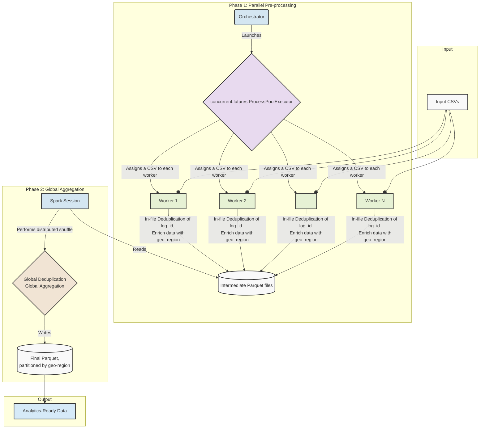
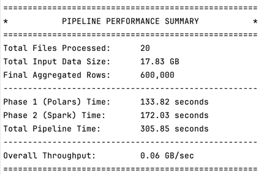
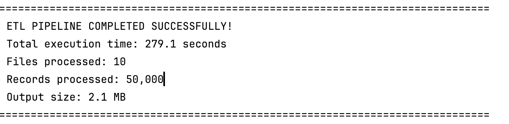

---

# ETL Pipeline project for InvestCloud (Polars + PySpark)

[](https://www.python.org/)
[](https://opensource.org/licenses/MIT)

This project demonstrates a robust, two-phase ETL pipeline designed for maximum performance and scalability when processing large volumes of log data. It intelligently combines the raw, single-machine speed of **Polars** for parallel pre-processing with the out-of-core, distributed power of **PySpark** for the final global aggregation.

## Problem Statement

A streaming service generates hundreds of large CSV files daily (1–10 GB each) containing user activity logs. The task is to build a scalable pipeline that can:
1.  Process all files in parallel.
2.  Deduplicate logs and enrich the data with geographic information.
3.  Aggregate the total watch time for every user.
4.  Write the final results to a compressed, query-optimized format.

## Key Features

*   **Hybrid Architecture:** Uses the best tool for the job: Polars for speed and PySpark for scale.
*   **Massively Parallel:** Processes multiple large CSV files simultaneously using all available CPU cores.
*   **Scalable by Design:** Handles datasets much larger than system memory thanks to Spark's out-of-core processing.
*   **Containerized & Portable:** Includes a `Dockerfile` for easy, dependency-free execution in any environment.
*   **Configurable:** All performance parameters, paths, and Spark settings are easily tunable in a central configuration file.
*   **Test Data Included:** Automatically generates a realistic test dataset on the first run.

## Architecture

The pipeline uses a two-phase architecture to efficiently process data, starting with raw speed and transitioning to robust, large-scale aggregation.

```
[Input CSVs] -> Phase 1: Pre-processing (Polars) -> [Intermediate Parquet] -> Phase 2: Aggregation (Spark) -> [Final Parquet]
```


### Phase 1: Parallel Pre-processing (Polars)

The first phase focuses on tasks that can be performed on each file independently. This is where we can achieve maximum speed.

*   **Technology:** Python's `concurrent.futures.ProcessPoolExecutor` and the **Polars** library.
*   **Process:**
    1.  The orchestrator launches a pool of worker processes (one for each CPU core).
    2.  Each worker process is assigned a single input CSV file.
    3.  Using Polars' highly-optimized Rust engine, the worker performs fast, in-memory transformations:
        *   **In-file Deduplication:** Removes duplicate records based on `log_id` within the file.
        *   **Data Enrichment:** Adds a `geo_region` column derived from the user's IP address.
    4.  The cleaned data is written to an intermediate directory as a compressed **Parquet** file. This format is crucial for speeding up the next phase.

### Phase 2: Global Aggregation (PySpark)

The second phase handles tasks that require a complete view of all the data, which may not fit into memory.

*   **Technology:** **Apache Spark (PySpark)**.
*   **Process:**
    1.  A local Spark session is started, configured to use all available machine resources.
    2.  Spark reads the entire set of intermediate Parquet files—a much faster operation than parsing raw CSVs.
    3.  A robust, distributed shuffle operation is performed to:
        *   **Global Deduplication:** Remove any duplicate `log_id` records that might have existed across different files.
        *   **Global Aggregation:** Group all records by `user_id` and calculate the total `watch_time(min)`.
    4.  The final aggregated data is written to a single, compressed Parquet directory, ready for analytics.

## How to Run


### Method 1: Local Machine

1.  **Prerequisites:**
    *   Python 3.9+
    *   Java 11+ (required by PySpark)

2.  **Set up Environment:**
    Clone the repository and set up a Python virtual environment:
    ```bash
    git clone https://your-repository-url.git
    cd your-repository-directory
    python -m venv venv
    source venv/bin/activate  # On Windows, use `venv\Scripts\activate`
    ```

3.  **Install Dependencies:**
    ```bash
    pip install -r requirements.txt
    ```

4.  **Run the Pipeline:**
    ```bash
    python main.py
    ```
    On the first run, the script will create a `pipeline_data` directory, generate test CSV files inside `pipeline_data/input_logs`, and place the final output in `pipeline_data/output`.

## Configuration

* You can change the number of input files, their size, and other parameters in `config.py`.

All key parameters can be tuned in `config.py` without modifying the core logic:

*   **Paths:** `INPUT_DIR`, `INTERMEDIATE_DIR`, and `OUTPUT_DIR`.
*   **Performance:** `PREPROCESSING_WORKERS` (number of parallel Polars processes).
*   **Spark Settings:** `SPARK_DRIVER_MEMORY`, `SPARK_EXECUTOR_MEMORY`, and `SPARK_SHUFFLE_PARTITIONS`.

## Project Structure

```
.
├── config.py                 # Central configuration for the pipeline
├── data_generator/           # Module for generating test CSV data
│   └── generator.py
├── main.py                   # Main entry point to run the pipeline
├── pipeline/                 # Core ETL logic
│   ├── aggregator.py         # Phase 2: Spark global aggregation
│   ├── orchestrator.py       # Main controller for the ETL flow
│   └── preprocessor.py       # Phase 1: Polars file pre-processing
├── utils/                    # Utility modules
│   └── metrics.py            # Dataclass for tracking performance
├── Dockerfile                # Defines the Docker container for portable execution
├── README.md                 # This file
└── requirements.txt          # Python package dependencies
```

## Things that I planned but didn't do due to time constraints


* I have a Dockerfile, but there was some issue during testing that I had to skip it for now. It should work with the right environment setup.
* DuckDB and Streamlit for Data Visualization: I considered integrating DuckDB for interactive querying and Streamlit for a web-based dashboard, but decided to focus on the core ETL functionality first.
* Data Validation: Implementing comprehensive data validation checks to ensure data integrity and quality.
* Error Handling: Adding robust error handling and logging mechanisms to capture and report issues during processing.
* Documentation: While this README provides an overview, more detailed inline comments and documentation for each module would enhance maintainability.

## Things I did but found not suitable 
* Used Polars for global aggregation, but it is not suitable for large data sets. It is better to use Spark for this task.
* Used Spark for pre-processing, but it is not suitable for very large data sets, especially CSV files. It is better to use Polars for this task.

Due to this I ended up with a hybrid setup that can effectively manage load + give the best performance for the given task.
You can read more about the 

## Output

 Performance summary after running the pipeline on a sample dataset of 20 files, each 1 GB in size. The output includes the time taken for each phase, the number of records processed, and the final aggregated results.

Pyspark on the other hand took almost similar time for csv parsing and deduplication for a much smaller dataset, when I ran the ETL Job as a Pyspark job.


### Docker ( slight issue now)

This is the easiest method as it handles all dependencies, including Python and Java.

1.  **Prerequisites:** Docker Desktop must be installed and running.

2.  **Build the Docker Image:**
    From the project's root directory, open a terminal and run:
    ```bash
    docker build -t etl-pipeline .
    ```

3.  **Run the Pipeline:**
    ```bash
    docker run --rm etl-pipeline
    ```
    The pipeline will execute inside the container, generate test data, process it, and print a performance summary.
